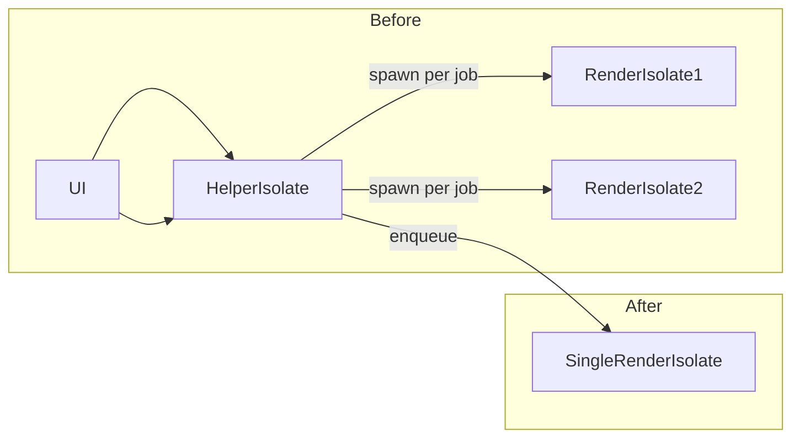

# INTERNAL – Windows Printing Enhancements (FFI) – Design & Implementation Notes

This document is intended for package maintainers/reviewers. It explains the technical background, the problems we saw in the field, the exact changes we made (with code snippets), and how to validate/roll back.

> Scope: Windows printing path only (C/FFI + Dart). macOS/Linux paths are unaffected except for shared models/bindings cleanup.

---

## 0) Problem Statement (Before)

- UI progress was poor: dialog stayed at “Submitting job…” and never reflected real progress.
- Inconsistent status mapping: Windows jobs often showed `Retained` or we assumed success when jobs vanished.
- Concurrency instability: starting multiple large jobs in quick succession could exhaust resources and terminate the app.
- Document names in queue were generic (e.g., “Flutter PDF Document”), hurting traceability.

---

## 1) Goals (After)

- Accurate, real‑time progress with smooth UI updates (pages printed only).
- Status fidelity aligned with Windows Print Queue (Spooling/Printing/Printed/Deleted/Paused/...).
- Robust multi‑job operation without app instability (serialize heavy work in a dedicated worker isolate).
- Use source filename in the doc name (e.g., `Flutter - <file.pdf>`).

---

## 2) Architecture Changes

### 2.1 Old vs New Render Execution

- Old: Each print spawned its own render isolate. Multiple large PDFs → multiple heavy isolates → potential resource exhaustion / app exit.
- New: A single, long‑lived “render worker” isolate processes a FIFO queue of render requests. All heavy work is serialized but overall app stability improves substantially.



Key snippet (Dart): enqueue instead of spawn

```dart
// lib/printing_ffi.dart (conceptual snippet)
await _ensureRenderWorkerIsRunning();
final workerData = _RenderWorkerData(jobStatePtr.address, dylibPath, data.id, data.progressPort);
_renderWorkerSendPort!.send(workerData); // serialized execution in single worker
```

Render worker loop (receives jobs, renders sequentially):

```dart
void _renderQueueWorkerEntryPoint(SendPort sendPort) {
  final receivePort = ReceivePort();
  sendPort.send(receivePort.sendPort);
  DynamicLibrary? dylib;
  PrintingFfiBindings? bindings;

  receivePort.listen((dynamic data) {
    if (data is _RenderWorkerData) {
      dylib ??= DynamicLibrary.open(data.dylibPath);
      bindings ??= PrintingFfiBindings(dylib!);
      final state = Pointer<PdfPrintJobState>.fromAddress(data.jobStatePtrAddress);
      var success = true;
      for (var i = 0; i < state.ref.page_count; i++) {
        if (state.ref.pages_to_print[i]) {
          data.progressPort?.send(_ProgressMessage(data.requestId, i + 1));
          if (!bindings!.render_pdf_job_page_win(state, i)) { success = false; break; }
        }
      }
      bindings!.finish_pdf_print_job_win(state, success);
    }
  });
}
```

### 2.2 Status Mapping (Windows)

Problem: Treating status as a single value instead of a bitwise flag caused wrong UI. We now decode flags in priority order.

```dart
// lib/models/print_job.dart (priority order)
if ((status & 0x00000002) != 0) return PrintJobStatus.error;     // ERROR
if ((status & 0x00000001) != 0) return PrintJobStatus.paused;    // PAUSED
if ((status & 0x00000400) != 0) return PrintJobStatus.deleting;  // DELETING
if ((status & 0x00000008) != 0) return PrintJobStatus.spooling;  // SPOOLING
if ((status & 0x00000010) != 0) return PrintJobStatus.printing;  // PRINTING
if ((status & 0x00000080) != 0) return PrintJobStatus.printed;   // PRINTED
if ((status & 0x00000200) != 0) return PrintJobStatus.retained;  // RETAINED
```

> References (Windows `winspool.h`):
> - `JOB_STATUS_PAUSED      0x00000001`
> - `JOB_STATUS_ERROR       0x00000002`
> - `JOB_STATUS_DELETING    0x00000004`
> - `JOB_STATUS_SPOOLING    0x00000008`
> - `JOB_STATUS_PRINTING    0x00000010`
> - `JOB_STATUS_PRINTED     0x00000080`
> - `JOB_STATUS_RETAINED    0x00000200`

### 2.3 Cancel Semantics – External & UI‑initiated

- Old: If a job vanished, we sometimes assumed success → false “Completed/Printed”.
- New: If a job disappears before reaching a terminal state, we synthesize `Canceled/Deleted` regardless of initiator (UI or external Print Queue “Cancel all”), matching native UX.

```dart
// lib/printing_ffi.dart (synthesis on disappearance)
if (synthesizedJobState != null && !terminalStates.contains(synthesizedJobState!.status)) {
  final int canceledRaw = Platform.isWindows ? 256 : 7; // DELETED / IPP CANCELED
  final canceledJob = PrintJob(
    synthesizedJobState!.id,
    synthesizedJobState!.title,
    canceledRaw,
    synthesizedJobState!.pagesPrinted,
  );
  if (canceledJob.rawStatus != synthesizedJobState!.rawStatus) {
    updateAndEmit(canceledJob);
  }
}
```

### 2.4 Models & Bindings (Current Shape)

We rely only on what we can guarantee across drivers:

- Native `JobInfo` (C): `id`, `title`, `status`, `pages_printed`.
- Dart `PrintJob`: `id`, `title`, `rawStatus`, derived `status`, `pagesPrinted`.

C header:

```c
// src/printing_ffi.h
typedef struct {
  uint32_t id;
  char *title;
  int32_t status;
  uint32_t pages_printed;
} JobInfo;
```

Dart model:

```dart
class PrintJob {
  final int id;
  final String title;
  final int rawStatus;
  final PrintJobStatus status;
  final int pagesPrinted;
  PrintJob(this.id, this.title, this.rawStatus, this.pagesPrinted)
    : status = PrintJobStatus.fromRaw(rawStatus);
}
```

### 2.5 UI/UX Updates

- Progress dialog shows only pages printed (e.g., “64 pages”).
- Added `Hide` button so long prints don’t block UI navigation.
- Terminal states: close on Completed/Printed/Canceled/Aborted/Error; `Retained` no longer treated as terminal.
- Document name sent to spooler now uses filename: `Flutter - <filename>.pdf`.

```dart
// example/lib/main.dart
final docName = 'Flutter - ${_selectedPdfPath!.split(Platform.pathSeparator).last}';
```

---

## 3) Native (C) Changes

### 3.1 Render Path Tweak

Removed per-page message pumping in `render_pdf_job_page_win` to reduce overhead in very large jobs.

```c
// src/printing_ffi.c (excerpt)
FFI_PLUGIN_EXPORT bool render_pdf_job_page_win(PdfPrintJobState *state, int page_index) {
  if (!state || page_index < 0 || page_index >= state->page_count) return false;
  FPDF_PAGE page = g_pdfium.FPDF_LoadPage(state->doc, page_index);
  if (!page) { set_last_error("Failed to load PDF page %d.", page_index + 1); return false; }
  if (StartPage(state->hdc) <= 0) { set_last_error("Failed to start page %d.", page_index + 1); g_pdfium.FPDF_ClosePage(page); return false; }
  // calculate dest rect ...
  g_pdfium.FPDF_RenderPage(state->hdc, page, dest_x, dest_y, dest_w, dest_h, rotation, FPDF_ANNOT | FPDF_PRINTING | FPDF_NO_NATIVETEXT);
  bool success = (EndPage(state->hdc) > 0);
  g_pdfium.FPDF_ClosePage(page);
  return success;
}
```

### 3.2 Job Listing Population

Ensure we only populate supported fields and always set `pages_printed`.

```c
list->jobs[i].id            = jobs[i].JobId;
list->jobs[i].title         = to_utf8(jobs[i].pDocument);
list->jobs[i].status        = (int)jobs[i].Status;
list->jobs[i].pages_printed = jobs[i].PagesPrinted;
```

---

## 4) API/Behavioral Differences

- Dialog now streams page progress and emits only on status/progress change.
- When jobs vanish before terminal states → `Canceled/Deleted` is synthesized (no more success-by-assumption).
- Document names in the spooler reflect the source filename.

---

## 5) Validation & Test Plan

### 5.1 Happy path
- Print a large PDF (200+ pages). Expect:
  - Dialog shows `Spooling` then smoothly increments pages: `1, 2, 3, ...`.
  - Hide dialog; job continues; Print Queue matches progress.
  - Terminal state becomes `Printed`.

### 5.2 External cancel
- From Windows Print Queue, use “Cancel all” while job is spooling/printing.
- Expect dialog to transition to `Canceled` within ~1 poll cycle. No “Completed”.

### 5.3 Multi‑job stability
- Start two large prints back‑to‑back.
- Expect app to stay responsive; render worker serializes jobs; no app exits.

### 5.4 Regression checks
- Default printer detection works; `isDefault` and `isAvailable` correctly mapped.
- No UI references to totals or size; progress is page‑based only.

---

## 6) Performance Notes

- Main stability/perf gain: serialized render worker isolate (no per-job isolates → no resource thrash).
- Minor gain: removed per-page message pumping.
- Future candidates (guarded by printer capabilities/tests):
  - Render flags tuning (e.g., drop `FPDF_NO_NATIVETEXT` if glyph mapping is acceptable for target printers).
  - Opportunistic parallel page precompute (only if memory constraints allow and driver can queue quickly).

---

## 7) Rollout & Rollback

- Rollout: ship as a minor version bump due to behavior changes.
- Rollback: revert to previous commit/tag; no schema migrations required.

---

## 8) FAQ

- Q: Why synthesize `Canceled` when a job vanishes?
  - A: This mirrors native UX. Disappearance without terminal flags almost always means external cancel; prior behavior guessed success and confused users.

- Q: Why only show pages and not totals/size?
  - A: Totals/size are not consistently available across drivers; page‑based progress is deterministic and consistent.

- Q: Why serialize rendering (isn’t parallel faster)?
  - A: Parallel heavy isolates caused OS‑level resource pressure and app termination in real‑world usage. Serialization trades theoretical peak throughput for practical stability.

---

## 9) Appendix – Key Snippets Collected

```dart
// Synthesize cancel on disappearance (lib/printing_ffi.dart)
if (synthesizedJobState != null && !terminalStates.contains(synthesizedJobState!.status)) {
  final int canceledRaw = Platform.isWindows ? 256 : 7;
  final canceledJob = PrintJob(
    synthesizedJobState!.id,
    synthesizedJobState!.title,
    canceledRaw,
    synthesizedJobState!.pagesPrinted,
  );
  if (canceledJob.rawStatus != synthesizedJobState!.rawStatus) {
    updateAndEmit(canceledJob);
  }
}
```

```dart
// Document name from source file (example/lib/main.dart)
final docName = 'Flutter - ${_selectedPdfPath!.split(Platform.pathSeparator).last}';
```

```c
// JobInfo struct (src/printing_ffi.h)
typedef struct {
  uint32_t id;
  char *title;
  int32_t status;
  uint32_t pages_printed;
} JobInfo;
```

---

## 10) Per‑file change log (code‑level)

- src/printing_ffi.h
  - `JobInfo` contains: `id`, `title`, `status`, `pages_printed`.
  - Declares Windows async PDF print API (`start_pdf_print_job_win`, `render_pdf_job_page_win`, `finish_pdf_print_job_win`).

- src/printing_ffi.c
  - `get_print_jobs`: populate `id`, `title`, `status`, `pages_printed` (from `JOB_INFO_2W`).
  - `render_pdf_job_page_win`: removed per-page Windows message pump; kept `FPDF_RenderPage` flags `FPDF_ANNOT | FPDF_PRINTING | FPDF_NO_NATIVETEXT`.
  - Windows defaults/utilities (`get_windows_printer_defaults`, etc.) preserved.

- lib/models/print_job.dart
  - Model fields: `id`, `title`, `rawStatus`, derived `status`, `pagesPrinted`.
  - `PrintJobStatus.fromRaw(int)`: prioritized bitwise mapping on Windows (PAUSED, ERROR, DELETING, SPOOLING, PRINTING, PRINTED, RETAINED ...).
  - Enum includes `spooling` and `deleting`; `statusDescription` aligned.

- lib/printing_ffi_bindings_generated.dart
  - `JobInfo` FFI struct aligned with C (`pages_printed`).
  - FFI bindings for `start_pdf_print_job_win`, `render_pdf_job_page_win`, `finish_pdf_print_job_win`.

- lib/printing_ffi.dart
  - Progress streaming
    - `_streamJobStatus`: emits only when status/progress changes.
    - If job disappears before terminal state → synthesize `Canceled/Deleted` (Windows: 256), emit once.
  - Render concurrency
    - Added singleton render worker: `_renderQueueWorkerEntryPoint`, `_renderWorkerIsolate`, `_renderWorkerSendPort`, `_ensureRenderWorkerIsRunning()`.
    - `_SubmitPdfJobRequest` enqueues `_RenderWorkerData` to the singleton worker instead of spawning per-job isolates.
  - Housekeeping: cancel tracking set removed from synthesis path (we now synthesize for all external/UI cancels on disappearance).

- example/lib/widgets.dart
  - `PrintStatusDialog`: shows only page progress; terminal-state logic updated; added `Hide` button.

- example/lib/main.dart
  - `docName` set to `Flutter - <pdf_filename>` for better traceability in the queue.

This section mirrors the concrete edits in this PR and should be used as the source of truth for review.
